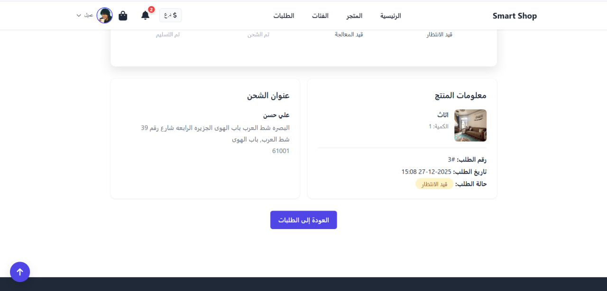

# 🛍️ Smart Shop / متجر ذكي

**نظام إدارة المتاجر الإلكترونية - E-commerce Management System**

A modern, bilingual (Arabic/English) e-commerce platform built with PHP and MySQL, featuring a complete shopping experience with user authentication, product management, shopping cart, and order processing.

---

## 📸 Screenshots / لقطات الشاشة

### Home Page / الصفحة الرئيسية

*الصفحة الرئيسية - Home Page*

### Products Page / صفحة المنتجات

*صفحة المنتجات - Products Page*

### Product Details / تفاصيل المنتج

*صفحة تفاصيل المنتج - Product Details Page*

### Shopping Cart / سلة التسوق

*سلة التسوق - Shopping Cart*

### Admin Dashboard / لوحة التحكم

*لوحة تحكم المسؤول - Admin Dashboard*

### User Profile / الملف الشخصي

*الملف الشخصي للمستخدم - User Profile*

> **Note / ملاحظة:** To add screenshots, place your images in the `screenshots/` folder and update the paths above.  
> لإضافة لقطات الشاشة، ضع الصور في مجلد `screenshots/` وقم بتحديث المسارات أعلاه.

---

## 📋 Table of Contents / جدول المحتويات

- [Screenshots / لقطات الشاشة](#-screenshots--لقطات-الشاشة)
- [Features / الميزات](#features--الميزات)
- [Technologies / التقنيات](#technologies--التقنيات)
- [Requirements / المتطلبات](#requirements--المتطلبات)
- [Installation / التثبيت](#installation--التثبيت)
- [Project Structure / هيكل المشروع](#project-structure--هيكل-المشروع)
- [Usage / الاستخدام](#usage--الاستخدام)
- [Contributing / المساهمة](#contributing--المساهمة)
- [License / الترخيص](#license--الترخيص)

---

## ✨ Features / الميزات

### For Users / للمستخدمين
- ✅ User Registration & Login / تسجيل الدخول والتسجيل
- ✅ Product Browsing / عرض المنتجات
- ✅ Search & Category Filtering / البحث والفلترة حسب الفئة
- ✅ Product Details / عرض تفاصيل المنتج
- ✅ Shopping Cart Management / إدارة سلة التسوق
- ✅ Order Processing / إتمام الطلب
- ✅ Order History / عرض الطلبات السابقة
- ✅ Order Tracking / تتبع الطلب
- ✅ User Profile Management / إدارة الملف الشخصي
- ✅ Notifications System / نظام الإشعارات

### For Administrators / للمسؤولين
- ✅ Admin Authentication / نظام المصادقة
- ✅ Protected Admin Pages / حماية الصفحات
- ✅ Product Management (Add/Edit/Delete) / إدارة المنتجات
- ✅ Category Management / إدارة الفئات
- ✅ Order Management / إدارة الطلبات
- ✅ Admin Dashboard / لوحة التحكم

---

## 🛠️ Technologies / التقنيات

- **Backend:** PHP 7.4+
- **Database:** MySQL 5.7+
- **Frontend:** HTML5, CSS3, JavaScript
- **Server:** Apache (XAMPP)
- **Icons:** Font Awesome 6.4.0
- **Security:** Prepared Statements, Password Hashing, XSS Protection

---

## 📦 Requirements / المتطلبات

- PHP 7.4 or higher
- MySQL 5.7 or higher
- Apache Web Server
- XAMPP (recommended for local development)

---

## 🚀 Installation / التثبيت

### 1. Clone the Repository / استنساخ المستودع

```bash
git clone https://github.com/zzziiiooi666-byte/smart-shop.git
cd smart-shop
```

### 2. Database Setup / إعداد قاعدة البيانات

1. Start XAMPP and ensure MySQL is running
2. Create a new database named `shop_smart`
3. Import the database schema:
   ```sql
   -- Run database/schema.sql in phpMyAdmin or MySQL command line
   ```
4. Update database credentials in `config/database.php`:
   ```php
   define('DB_HOST', 'localhost');
   define('DB_NAME', 'shop_smart');
   define('DB_USER', 'root');
   define('DB_PASS', '');
   ```

### 3. Configuration / الإعدادات

Update `config/config.php` with your local settings:
- Base URL
- File paths
- Session settings

### 4. File Permissions / صلاحيات الملفات

Ensure the `uploads` directory has write permissions:
```bash
chmod 755 uploads
```

### 5. Access the Application / الوصول للتطبيق

Open your browser and navigate to:
```
http://localhost/smart_markt
```

---

## 📁 Project Structure / هيكل المشروع

```
smart_markt/
├── admin/              # Admin panel / لوحة التحكم
├── auth/               # Authentication / المصادقة
├── user/               # User pages / صفحات المستخدم
├── pages/              # Main pages / الصفحات الرئيسية
├── api/                # API endpoints / نقاط نهاية API
├── assets/             # CSS, JS, Images / الملفات الثابتة
├── config/             # Configuration files / ملفات الإعدادات
├── database/           # SQL scripts / سكربتات قاعدة البيانات
├── includes/           # Header & Footer / الرأس والتذييل
├── tools/              # Utility scripts / أدوات مساعدة
└── report/             # Documentation / التوثيق
```

---

## 💻 Usage / الاستخدام

### Default Admin Account / حساب المدير الافتراضي

After setting up the database, you can create an admin account or use the default:
- **Username:** admin
- **Password:** (set during installation)

### Adding Products / إضافة المنتجات

1. Log in as admin
2. Navigate to Admin Panel
3. Click "Add Product"
4. Fill in product details and upload images

### User Registration / تسجيل المستخدمين

Users can register through the registration page and start shopping immediately.

---

## 🤝 Contributing / المساهمة

Contributions are welcome! Please feel free to submit a Pull Request.

1. Fork the repository
2. Create your feature branch (`git checkout -b feature/AmazingFeature`)
3. Commit your changes (`git commit -m 'Add some AmazingFeature'`)
4. Push to the branch (`git push origin feature/AmazingFeature`)
5. Open a Pull Request

---

## 📝 License / الترخيص

This project is licensed under the MIT License - see the [LICENSE](LICENSE) file for details.

---

## 🔒 Security / الأمان

⚠️ **Note:** This project is for learning and development purposes. For production use:
- Use HTTPS
- Add CSRF Protection
- Implement Rate Limiting
- Use Environment Variables for secrets
- Regular security audits

---

## 📞 Support / الدعم

If you encounter any issues:
1. Check the `error_log` in XAMPP
2. Verify PHP settings (`phpinfo()`)
3. Check file and folder permissions
4. Ensure PHP and MySQL versions are compatible

---

## 🌟 Future Enhancements / التحسينات المستقبلية

- [ ] Payment Gateway Integration (Razorpay/PayPal)
- [ ] Product Reviews & Ratings
- [ ] Coupon System
- [ ] Sales Reports
- [ ] Email Notifications
- [ ] Multi-language Support
- [ ] Mobile App API

---

**Developed with ❤️ using PHP + MySQL + HTML + CSS + JavaScript**

**Version:** 1.0.0  
**Last Updated:** 2024

---

## 📚 Documentation / التوثيق

For more detailed documentation, please refer to:
- [SETUP.md](SETUP.md) - Detailed setup instructions
- [GITHUB_SETUP.md](GITHUB_SETUP.md) - GitHub setup guide
- [report/](report/) - Project reports and documentation
